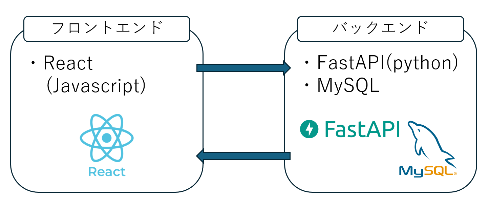
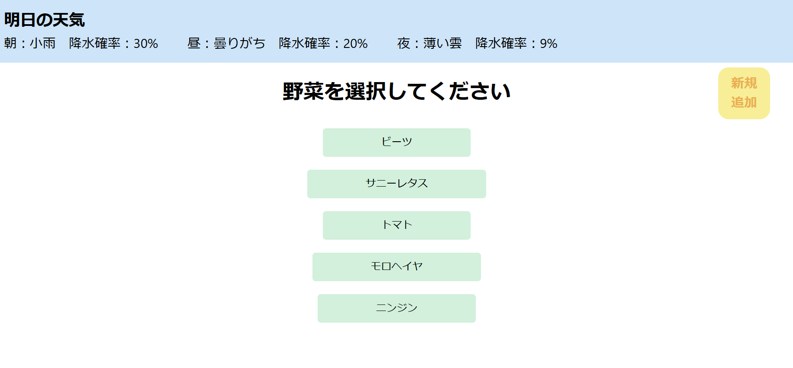
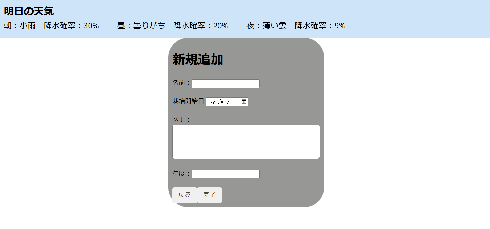
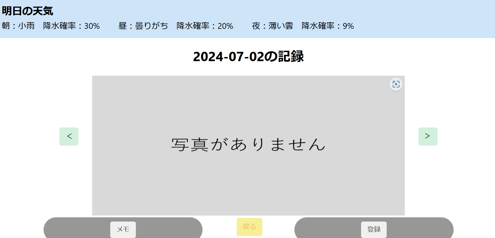
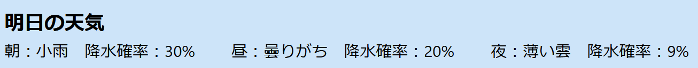
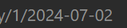
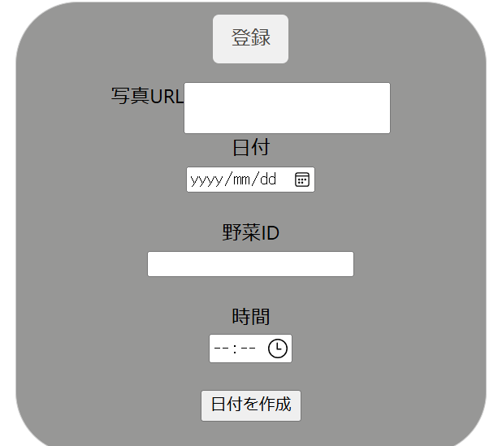
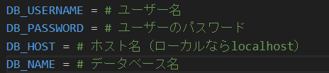
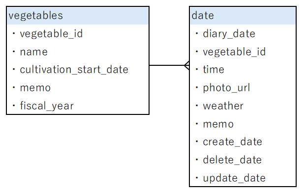

# Gaedening_Diary

# システム構成図
    

# 動作イメージ
https://github.com/matsuri002/Gaedening_Diary/assets/144910260/a51c0d9e-181c-4f7b-95a5-4ffca4bd6169

# サービス概要
- 家庭菜園をしている人向けに、写真をアップロードし栽培日記を作る
- 水やりの指標のため明日の天気を表示する

# アプリを作ったきっかけ
　自分が家庭菜園を行う中で、怠慢による水のあげ忘れや、専門的な知識もないため病気の発生等で困っていた。また、せっかく肥料を与えたのに翌日の大雨により効果が薄れたり、気象災害で上手く収穫できなかったりした。そして飽き性な私にとって一番大変なことは「モチベーションを維持すること」で、植物に興味がなくなることで放置し枯れる、ということを何度も繰り返してきた。そこでモチベーションを維持が維持できるかつ利用者の役に立つ栽培管理アプリを作成した。

# 機能
| Topページ | 新規登録ページ |
| ---- | ---- |
|  | |
| Topページは新規登録で作成した野菜の名前が表示されるようにした。 | 新規登録ページではシンプルな構成で、翌年も同じ種類の野菜を育てる可能性があるため年度も入力できるようになっている。 |  

| 記録ページ | 天気 |
| ---- | ---- |
| | |
| 写真を登録すると「写真がありません」から登録した写真が表示されるようになる。緑のボタンを押せば前日・翌日とページが移動し記録を見ることができる。 | 福岡県の翌日の天気をOpenWeatherから取得し時間ごとに朝・昼・夜として表示している。これにより写真を記録する際に翌日の天気を知ることができ、水やりの指標となる。 

| メモ | 登録 |
| ---- | ---- |
| | |
| その日の記録を入力する。写真だけでは分からない状況を記録できるため、病気等になったときに振り返って原因考察ができる。 | Google DriveからURLを取得し「写真URL」に入力する。日付は写真を撮った日で、野菜IDはアドレスバーに表示されている数字を入力する（この写真では「1」） |

# 今後の展望
水やりや写真の撮影をRaspberry piで自動化することにより省力化を行う。「収量ランキング」のような他の人と競うことで家庭菜園への意欲向上や、「病気検索」でどのような病気があるのか見れるようにしたい。また栽培記録を公開することでどんな工夫しているのか、どのような育て方をしたのか知ることができ、失敗しても成功しても家庭菜園の「教科書」として未来の家庭菜園を行う人が生かすことができる。

# 環境構築
1. リポジトリをクローンする  
git clone git@github.com:matsuri002/Gaedening_Diary.git
2. npm installの方法  
cd Gaedening_Diary  
cd my-app  
npm install
3. requirements.txtのインストール  
cd Gaedening_Diary  
pip install -r requirements.txt

## DBの作成
1. template.envファイルを以下の写真のようにする  

2. .gitignoreファイルにtemplate.envと記述する
3. sudo service mysql start
4. sudo mysql -u root -p
5. CREATE DATABASE <DB名>;
6. CREATE USER '<ユーザー名>'@'localhost' IDENTIFIED BY '<password>';
7. GRANT ALL PRIVILEGES ON <DB名>* TO 'ユーザー名'@'localhost';
8. flush privileges;
9. exit;

# ローカルで動かす手順  
＊ FastAPIとReactはそれぞれ別のターミナルで立ち上げる
## Reactの起動
1. ディレクトリをGaedening_Diaryに移動する  
cd Gaedening_Diary
2. ディレクトリをmy-appに移動する  
cd my-app
3. FastAPIの起動  
npm start

## MySQLの起動
1. MySQLの起動  
sudo service mysql start

## FastAPIの起動
1. ディレクトリをGaedening_Diaryに移動する  
cd Gaedening_Diary
2. ディレクトリをserverに移動する  
cd server
3. サーバーの起動  
uvicorn main:app

# ER図

# API仕様書
以下参照  
https://matsuri002.github.io/Gaedening_Diary/
