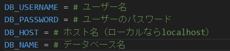
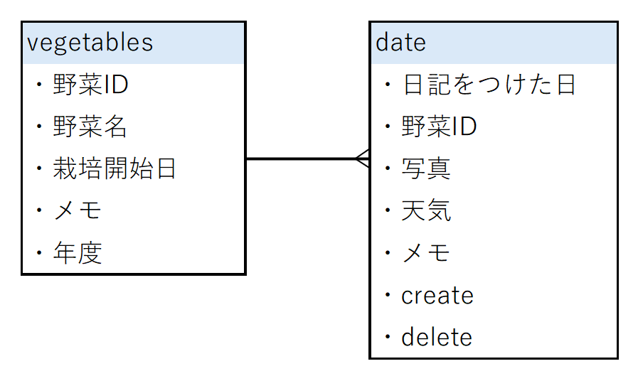

# Gaedening_Diary

# 機能
- 家庭菜園をしている人向けに、写真をアップロードし栽培日記を作る
- 水やりの指標のため明日の天気を表示させる

# 意図
- 水のやり忘れ、病気等の防止
- 習慣が付け、モチベーションの維持
- 病気の原因発見

# 環境構築
1. リポジトリをクローンする  
git clone git@github.com:matsuri002/Gaedening_Diary.git
2. npm installの方法  
cd Gaedening_Diary  
cd my-app  
npm install
3. requirements.txtのインストール  
cd Gaedening_Diary  
pip install -r requirements.txt

## DBの作成
1. Gaedening_Diary直下に.envファイルを作成する。内容は以下の写真のようにする  

2. sudo service mysql start
3. sudo mysql -u root -p
4. CREATE DATABASE ＜DB名＞ ;
5. CREATE USER '＜ユーザー名＞'@'localhost' IDENTIFIED BY '＜password＞';
6. GRANT ALL PRIVILEGES ON test5.* TO '＜ユーザー名＞'@'＜localhost＞';
7. flush privileges;
8. exit;

# ローカルで動かす手順  
＊ FastAPIとReactはそれぞれ別のターミナルで立ち上げる
## Reactの起動
1. ディレクトリをGaedening_Diaryに移動する  
cd Gaedening_Diary
2. ディレクトリをmy-appに移動する  
cd my-app
3. FastAPIの起動  
npm start

## MySQLの起動
1. MySQLの起動  
sudo service mysql start

## FastAPIの起動
1. ディレクトリをGaedening_Diaryに移動する  
cd Gaedening_Diary
2. ディレクトリをserverに移動する  
cd server
3. サーバーの起動  
uvicorn main:app

# ER図

 
