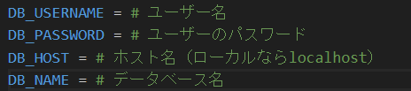

# Gaedening_Diary

# 環境構築
1. リポジトリをクローンする  
git clone git@github.com:matsuri002/Gaedening_Diary.git
2. npm installの方法  
cd Gaedening_Diary  
cd my-app  
npm install
3. requirements.txtのインストール  
cd Gaedening_Diary  
pip install -r requirements.txt

## DBの作成
1. template.envファイルを以下の写真のようにする  

2. .gitignoreファイルにtemplate.envと記述する
3. sudo service mysql start
4. sudo mysql -u root -p
5. CREATE DATABASE <DB名>;
6. CREATE USER '<ユーザー名>'@'localhost' IDENTIFIED BY '<password>';
7. GRANT ALL PRIVILEGES ON <DB名>* TO 'ユーザー名'@'localhost';
8. flush privileges;
9. exit;

# ローカルで動かす手順  
＊ FastAPIとReactはそれぞれ別のターミナルで立ち上げる

## MySQLの起動
1. MySQLの起動  
sudo service mysql start

## FastAPIの起動
1. ディレクトリをGaedening_Diaryに移動する  
cd Gaedening_Diary
2. ディレクトリをserverに移動する  
cd server
3. サーバーの起動  
uvicorn main:app